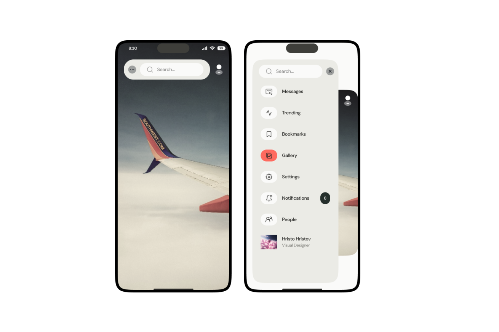

### Getting Started

An amazing UI Design from figma community. Done with Flutter

```bash
flutter pub get
flutter run
```

- [Figma File ](https://www.figma.com/community/file/1384667985111206688/interactive-hamburger-menu?searchSessionId=lxwxfpxu-au43eo97nis)

A few resources to get you started if this is your first Flutter project:

- [Lab: Write your first Flutter app](https://docs.flutter.dev/get-started/codelab)
- [Cookbook: Useful Flutter samples](https://docs.flutter.dev/cookbook)

For help getting started with Flutter development, view the
[online documentation](https://docs.flutter.dev/), which offers tutorials,
samples, guidance on mobile development, and a full API reference.

## Gallery

<table>
  <tr>
    <td>
      <a href="#">
        
      </a>
    </td>

</table>
